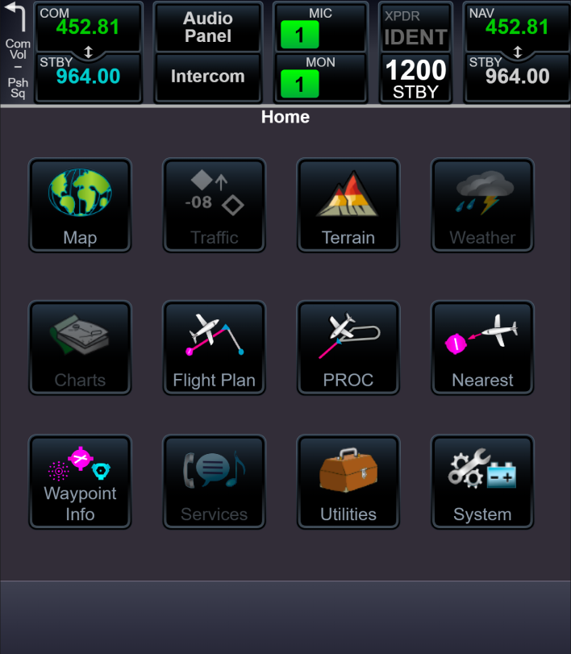

# GTN 750Xi

> This project doesn't have deployed version. You can only see code [here](./code-example/HorizontalSituationIndicator) (horizontal situation indicator).

## Technologies used

- React;
- React Router DOM;
- React Konva (for canvas).

## Project description

This project represents flight instrument [GTN 750Xi](https://buy.garmin.com/en-US/US/p/606798). Purpose of work was creating browser version aircraft instrument. Buttons group, radio panel, modal windows for radio panel, pages with keyboards and setup routing for all windows where created.

Project presentation divided into several parts:

- [UI elements](./ui/README.md);
- [Components for data entry](./input-components/README.md);
- [Radio panel](./radio-panel/README.md);
- [System windows](./system-windows/README.md).
