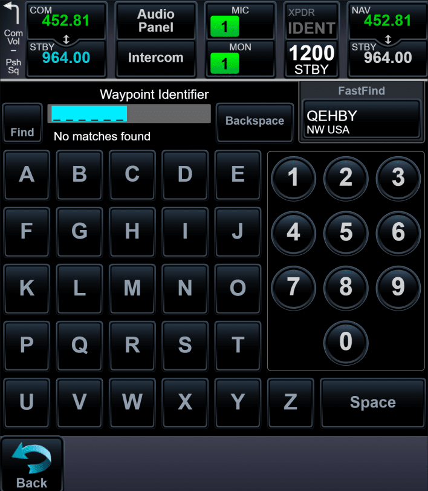
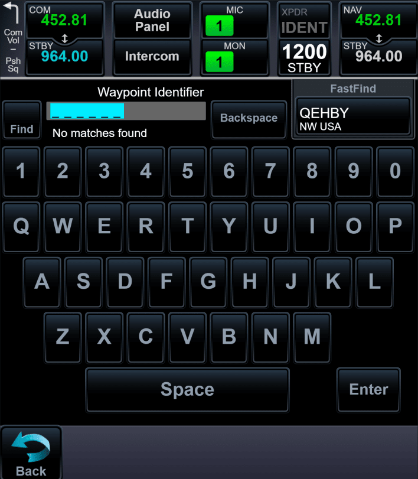
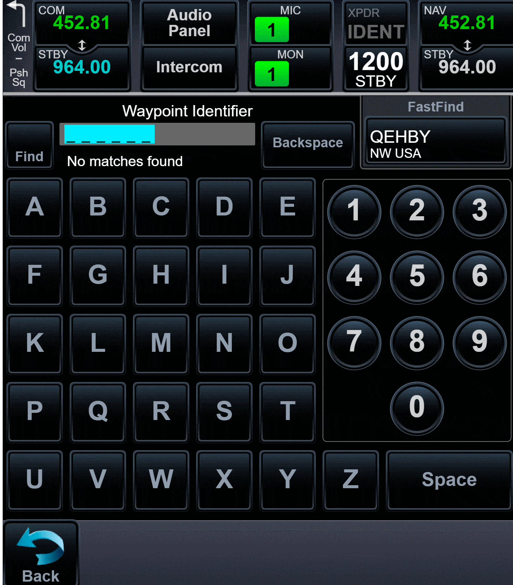
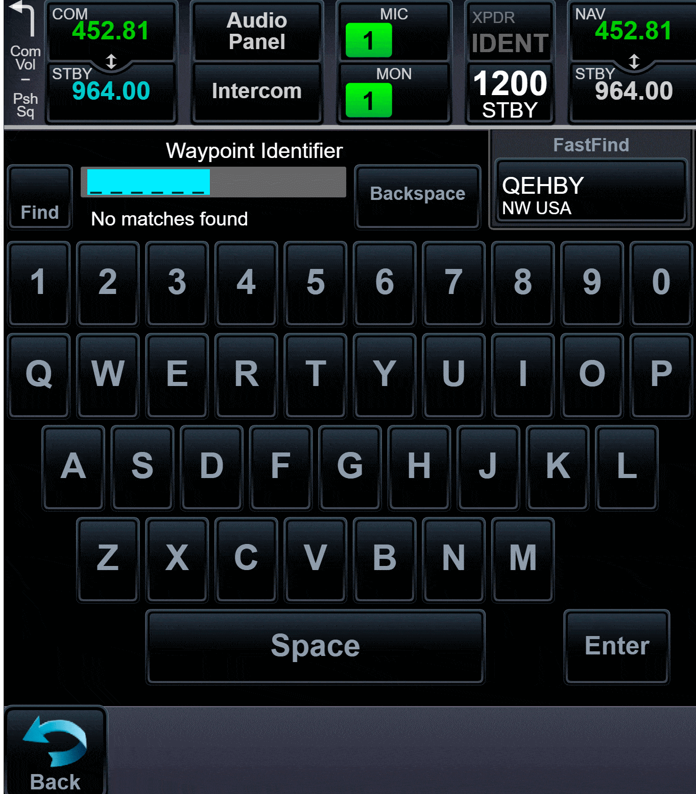
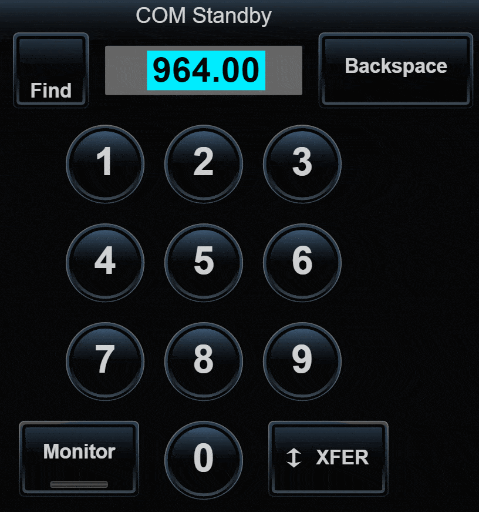
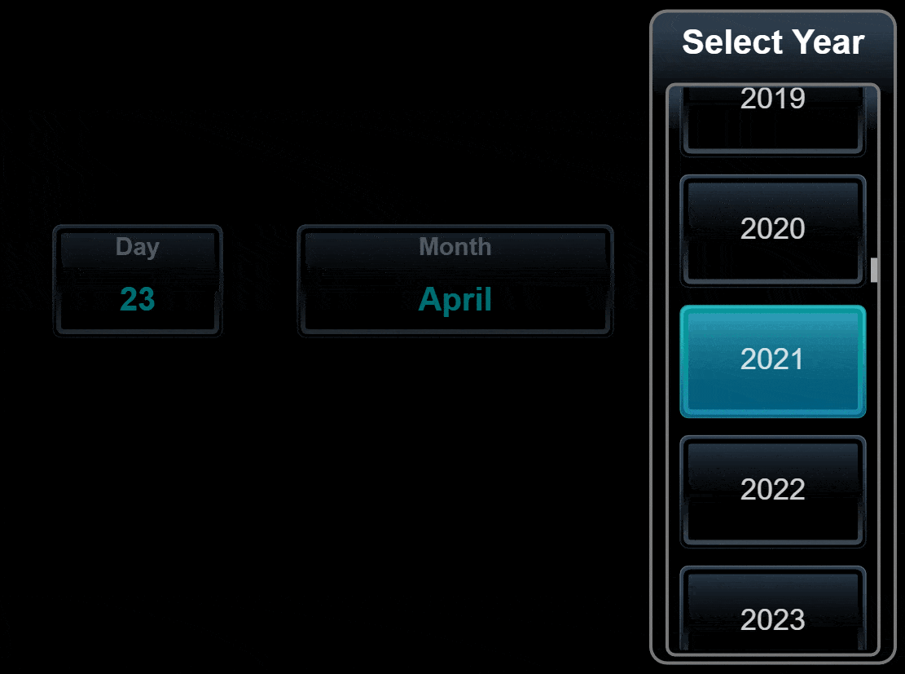
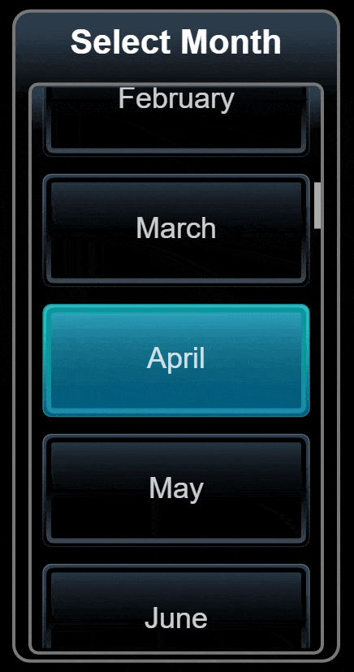

# Components for data entry

Application has special windows (components) for data entry. It can be frequency, waypoint, date and other. Application has next special windows:

- [Keyboard](#Keyboard) (ABC and QWERTY layouts);
- [Numpad](#Numpad);
- [Datepicker](#Datepicker).

## Keyboard

ABC layout:



QWERTY layout:



Input in keyboard has placeholder and value. Now for test purpose placeholder equal `value + 'A'`.





Keyboard component has array which is render on screen. Size properties are setted in code.

Keyboard ABC:

```js
const keyboard = [
    ['A', 'B', 'C', 'D', 'E'],
    ['F', 'G', 'H', 'I', 'J'],
    ['K', 'L', 'M', 'N', 'O'],
    ['P', 'Q', 'R', 'S', 'T'],
    ['U', 'V', 'W', 'X', 'Y', 'Z', ' '],
]

const buttonGap = 7
const buttonHeight = height / keyboard.length - buttonGap * 2
const numpadLayoutWidth = 250
const numpadLayoutHeight = (buttonHeight + buttonGap * 2) * 4 - buttonGap * 2
const buttonWidth = (width - numpadLayoutWidth - 5 * 2) / keyboard[0].length - buttonGap * 2
```

Keyboard QWERTY:

```js
const keyboard = [
    ['1', '2', '3', '4', '5', '6', '7', '8', '9', '0'],
    ['Q', 'W', 'E', 'R', 'T', 'Y', 'U', 'I', 'O', 'P'],
    ['A', 'S', 'D', 'F', 'G', 'H', 'J', 'K', 'L'],
    ['Z', 'X', 'C', 'V', 'B', 'N', 'M'],
    [' '],
]

const buttonGap = 5
const buttonHeight = 80
const buttonWidth = (width - 2.5) / keyboard[0].length - buttonGap * 2
```

## Numpad

Numpad primary needed for input frequency. User can input frequency in 118 - 137 range.



## Datepicker

Using datepicker user can choose date. Datepicker use some special components for modal window and scroll.





<hr>

[Back](https://github.com/tppd67421/GTN-750Xi)

[Prev - UI elements](../ui/README.md)

[Next - Radio panel](../radio-panel/README.md)