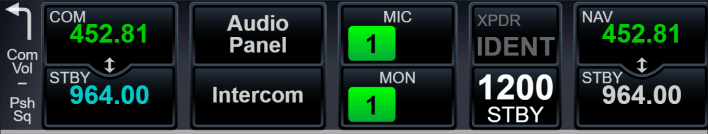
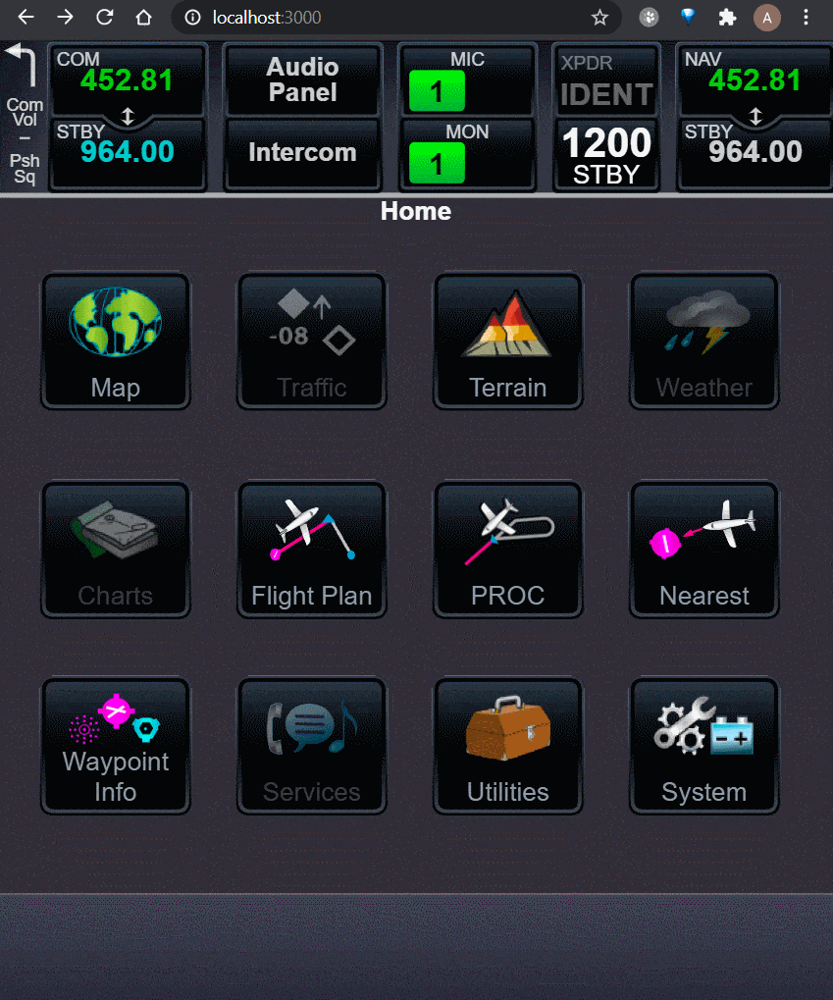
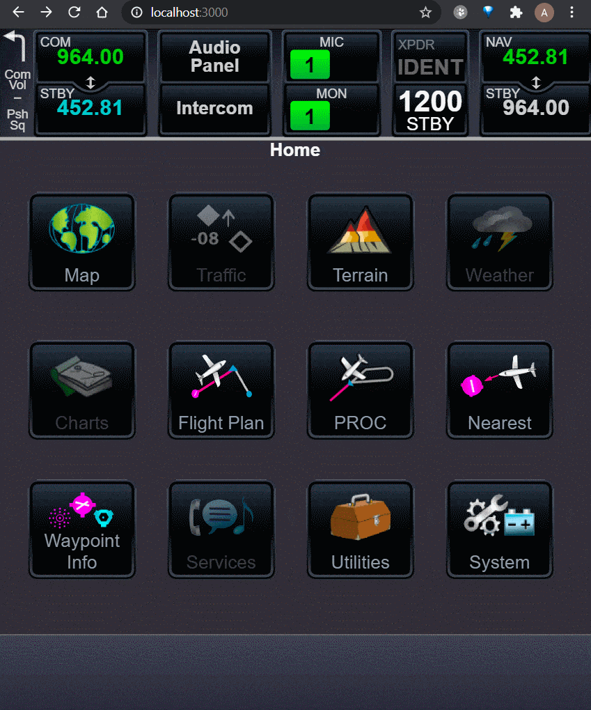
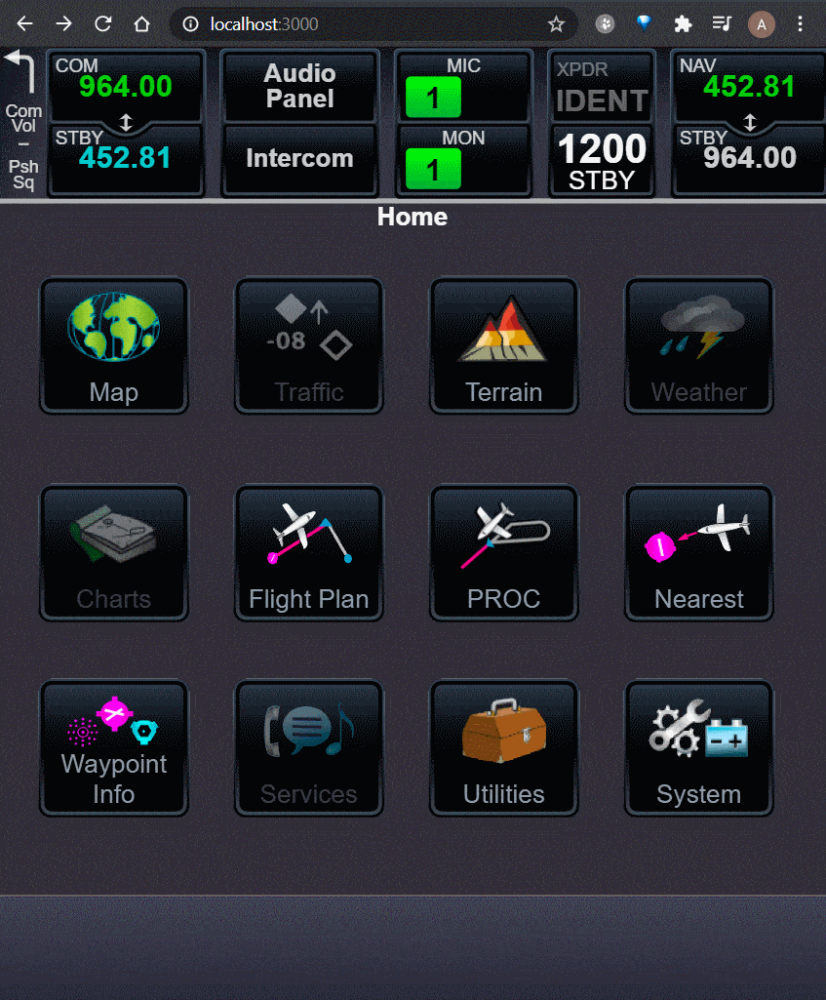
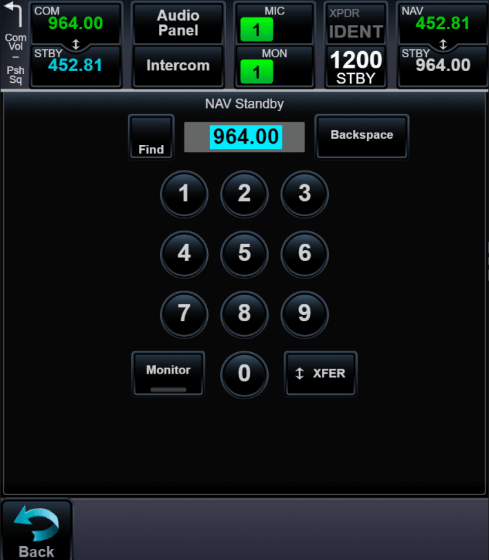

# Radio panel

Radio panel has 6 components: component with additional information and 5 group buttons.

All windows from radio component opened as full screen modal window. `history.push` and `history.replace` are combined for radio modal window routing.

- [First group of buttons](#First-group-of-buttons); 
- [Second group of buttons](#Second-group-of-buttons); 
- [Third group of buttons](#Third-group-of-buttons); 
- [Fourth group of buttons](#Fourth-group-of-buttons); 
- [Fifth group of buttons](#Fifth-group-of-buttons); 

## First group of buttons

## Second group of buttons

Arrows from Intercom drawn using line and quadratic curve. Curve arrows take width, height and degree. Alghoritm transforms degree and size into coordinates with using trigonometry functions (sinus and cosinus).

## Third group of buttons

Third group doesn't have modal window. This button only has a number switching algorithm.

## Fourth group of buttons

## Fifth group of buttons

The fifth group of buttons is not very different from the first group.

[Back](https://github.com/tppd67421/GTN-750Xi)

[Prev - Components for input information](../input-components/README.md)

[Next - System windows](../system-windows/README.md)
