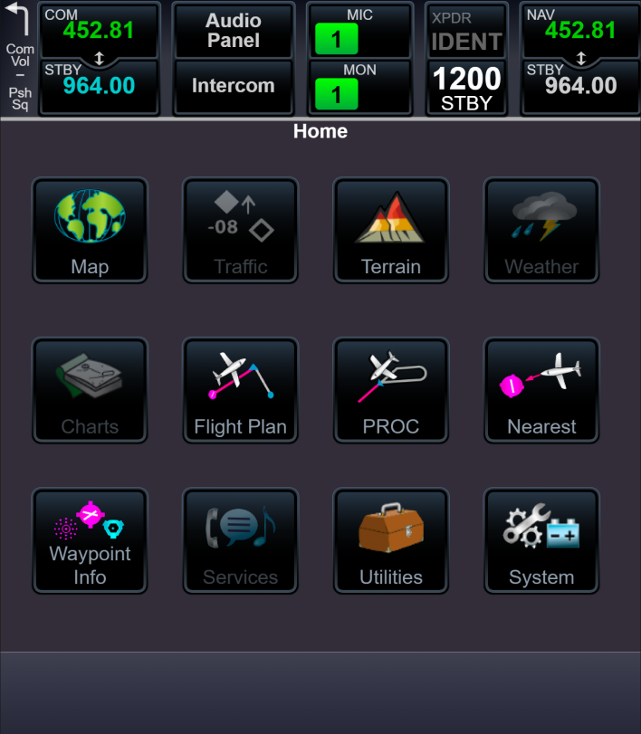

# System windows

There are many windows in the system, but now created a small part. Was created next windows which (but many windows created not fully):

- [PROC](#PROC);
- [Utilities](#Utilities);
- [System](#System).

## PROC

PROC has inside one component and this component has various appearance. Appearance can setup with use React props.

Scrolling list, place with border for future map and two buttons with path to keyboard and numpad locate into PROC type component:

Animated version:

## Utilities

Utilities has submenu with other items:

Created items:

- VNAV;
- Trip Planning; 
- Fuel Planning;
- RAIM Prediction;
- Flight Timers.

VNAV:

Trip Planning:

Fuel Planning:

RAIM Prediction:

Flight Timers:

Animated version:

## System

System doesn't has big functionality. Now it is a submenu with configured routing.

[Back](https://github.com/tppd67421/GTN-750Xi)

[Prev - Radio panel](../radio-panel/README.md)
