# UI elements

Application has UI elements such as buttons. Project has next button types:

- [Simple button](#Simple-button);
- [Upper and lower buttons](#Upper-and-lower-buttons);
- [Upper and lower buttons with convex](#Upper-and-lower-buttons-with-convex);
- [Left and right buttons](#Left-and-right-buttons);
- [Circle buttons](#Circle-buttons).

Also next spetial content was created for buttons:

- [Light and dark line](#Light-and-dark-line)

## Simple button

> The simple button code can found [here](../code-example).

A simple button you can see on the main home screen. This button also located in other places.

Simple buttons:

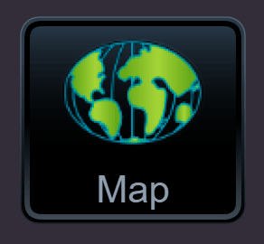

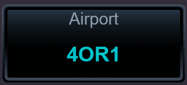

Simple button disabled:

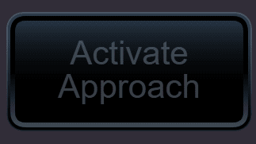

Simple button selected:

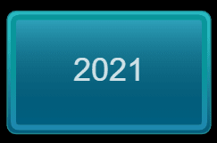

All this buttons are one component with many parameters. Some of this parameters are listed below:

- Size parameters (width, height, border size and others);
- Content (takes function or React component);
- Position (for upper and lower buttons);
- Click function (function, which will run after click on button);
- Disabled (show button as disabled and don't run click function);
- Selected.

Buttons have pressed and normal state:

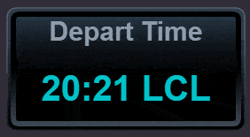

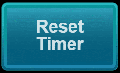

Application has scrolling components and all buttons should have cursor move protection. If mouse cursor moving more then setted value, button becomes unpressed and click function after `mouseup` doesn't run.

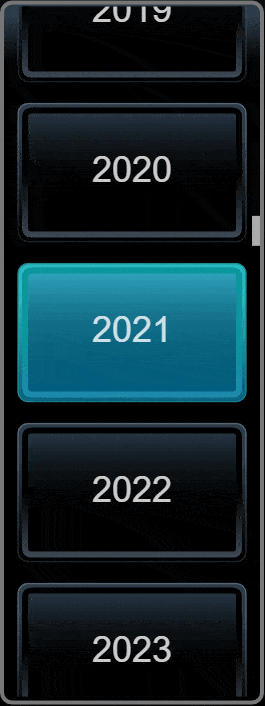

All next buttons based on simple button and don't have a lot difference.

## Upper and lower buttons

> All buttons consist of button component and background. This separation is necessary because the double button has one background. But each button has own active background (looks like a border).

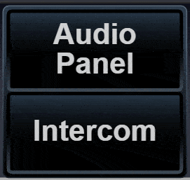

## Upper and lower buttons with convex

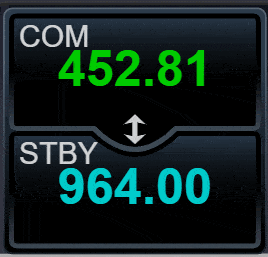

## Left and right buttons

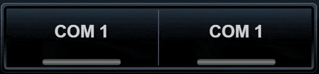

## Circle buttons

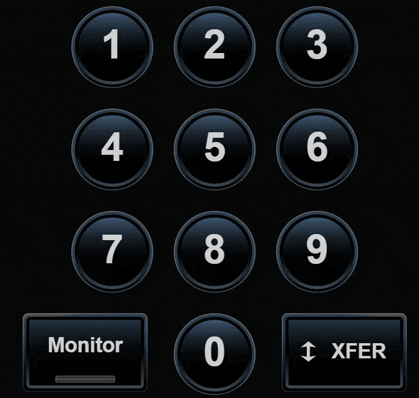

## Light and dark line

Button can have dark or light luminous line. For this it is necessary to path the line component with content to the button.

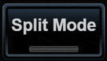

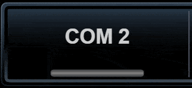

[Back](https://github.com/tppd67421/GTN-750Xi)

[Next - Components for input information](../input-components/README.md)
